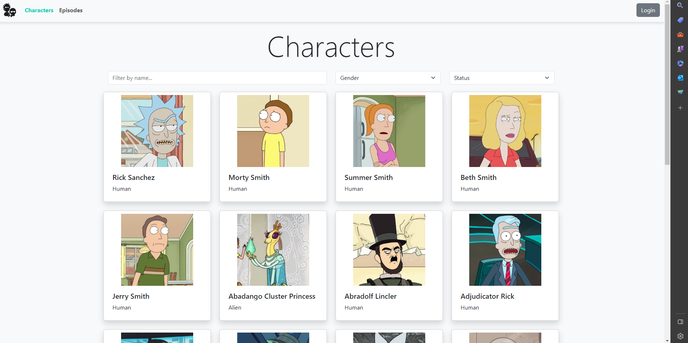

🛸 WebRickMorty
Aplicativo web desenvolvido em Angular que consome dados da API pública Rick and Morty. O objetivo é listar, detalhar e apresentar informações sobre personagens da série animada "Rick and Morty" de forma dinâmica e interativa.

🧠 Descrição do Projeto
O WebRickMorty é um projeto desenvolvido utilizando o framework Angular, com o objetivo de consumir dados da API pública Rick and Morty. O aplicativo permite visualizar uma lista de personagens, acessar os detalhes de cada personagem e uma tela final com informações do desenvolvedor. Além disso, tem a barra de pesquisa, ajudando a achar algum personagem em específico.

O projeto foi desenvolvido para fins acadêmicos, com foco na prática de consumo de APIs, e navegação entre telas e aplicação de princípios básicos de UI/UX.

⚙️ Pré-requisitos
Para executar este projeto, é necessário ter instalado:

✔️ Node.js (versão recomendada: LTS) 

✔️ Angular CLI (instalar com npm install -g @angular/cli)

✔️ Git (opcional, para clonar o projeto) 

✔️ VSCode ou outro editor

⬇️ Como baixar e rodar o projeto
Clone o repositório

git clone https://github.com/claramatosdt/webRickMorty.

Acesse a pasta do projeto:
cd webRickMorty

Instale as dependências:
npm 

Execute o projeto:
ng serve
Abra no navegador:
Acesse http://localhost:4200/ para visualizar o projeto.

Telas

👩‍💻 Autora
Nome: Maria Clara Duarte

Curso: Análise e Desenvolvimento de Sistemas - Embarque Digital/ 2º período

